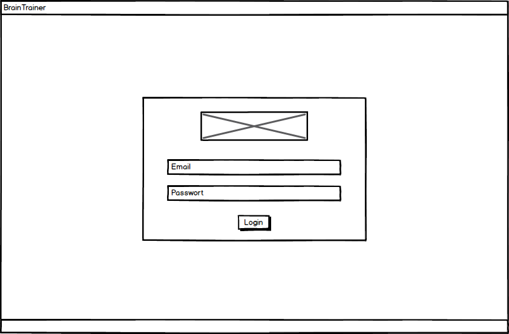

# Pflichtenheft - Brain Trainer
## Inhaltsverzeichnis
1. [User Stories](#user-stories)
2. [Use Cases](#use-cases)
3. [GUI-Mockups](#gui-mockups)
4. [Systemarchitektur](#systemarchitektur)
5. [Datenmodell](#datenmodell)
6. [Zielbestimmung](#zielbestimmung)
7. [Produkteinsatz](#produkteinsatz)
8. [Rollen](#rollen)
9. [Projektplan](#projektplan)

## 1. User Stories
| Ich als | möchte | so dass | Akzeptanz |
| :------ | :----- | :------ | :-------- |
| Nutzer | Übungen erhalten | ich die Karteikarten wiederholen kann | Eine Übung wurde als Pop-Up gestartet |
| Nutzer | Karteikarte manuell starten | ich jederzeit die Karteikarte lernen kann | Eine Karteikarte wurde als Pop-Up gestartet |
| Nutzer | eine zufällige Übung manuell starten | ich jederzeit die Karteikarten lernen kann | Eine Übung wurde als Pop-Up gestartet |
| Nutzer | bei Fehleingabe die Lösung angezeigt bekommen | ich lernen kann | Lösung wird angezeigt |
| Nutzer | Karteikarten erzeugen können | diese als Pop-Up Benachrichtigung angezeigt werden können | Karteikarte wurde erzeugt |
| ** Nutzer | beim Karteikarten erzeugen zwischen verschiedenen Typen wählen können | die  geeignet dargestellt werden kann | Die Karteikarte wurde gemäß ihres Typs angezeigt |
| Nutzer | Karteikarten ändern können | man den Inhalt berichtigen kann | Karteikarte wurde geändert |
| Nutzer | Karteikarten löschen können | diese entfernt wird | Karteikarte wurde entfernt |
| Nutzer | Karteikarten anzeigen können | man den Inhalt lesen kann | Karteikarte wurde angezeigt |
| Nutzer | Sets erzeugen können | ich Karteikarten bündeln kann | Set wurde erzeugt |
| Nutzer | Sets ändern können | man den Inhalt berichtigen kann | Set wurde geändert |
| Nutzer | Sets löschen können | diese entfernt wird | Set wurde entfernt |
| Nutzer | Sets Tags zuweisen | diese sortiert werden können | Sets wurde Tag zugewiesen |
| Nutzer | Karteikarten Sets zuordnen können | diese gebündelt werden | Karteikarte wurde Set zugewiesen |
| Nutzer | die Häufigkeit und Menge der Pop-Ups einstellen können | diese individuell abgestimmt als Pop-Up angezeigt werden | Angegebene Menge der Pop-Ups erscheint in der angegebenen Zeit |
| ** Nutzer | die Art des Pop-Ups auswählen können | dies auf meine Bedürfnisse abgestimmt ist | Art des Pop-Ups wurde angepasst |
| Nutzer | die Anwendung im Tray sehen können | ich direkt darauf zugreifen kann | Anwendung wird im Tray angezeigt |
| Nutzer | die Anwendung aus dem Tray heraus maximieren können | die Anwendung im Fenster dargestellt wird | Anwendung wird als Fenster angezeigt |
| ** Nutzer | Statistiken anschauen | ich die Statistiken anschauen kann | Die Statistiken wurden angeschaut |
| Nutzer | mich mit meinem Profil anmelden können | ich die Online Features nutzen kann | Benutzer hat Zugriff auf die Online Features |
| Nutzer | mich von meinem Profil abmelden können | ich abgemeldet bin | Benutzer ist abgemeldet |
| Nutzer | mein Profil als Privat deklarieren | andere Profile meine Abonnenten und meinen Feed sehen können | Meine Abonnenten und mein Feed wird anderen Profilen angezeigt |
| Nutzer | mein Profil als Public deklarieren | andere Profile meine Abonnenten und meinen Feed nicht sehen können | Meine Abonnenten und mein Feed wird anderen Profilen nicht angezeigt |
| Nutzer | mein Profil anschauen können | ich meine Profilinformationen anschauen kann | Nutzerprofil wird angezeigt |
| Nutzer | von einem Profil die Sets ansehen | mir die Sets des Profils angezeigt werden | Die Sets des Profils werden angezeigt |
| Nutzer | von einem Profil den Feed ansehen | mir der Feed des Profils angezeigt wird | Der Feed des Profils wird angezeigt |
| Nutzer | von einem Profil die Abonnenten ansehen | mir die Abonnenten des Profils angezeigt werden | Die Abonnenten des Profils werden angezeigt |
| Nutzer | Sets als Public oder Private deklarieren können | die Sets der Einstellung nach sichtbar sind | Sets wurden deklariert |
| ** Nutzer | Sets mit Hilfe einer URL beschränkt veröffentlichen (protected) | die Sets beschränkt sichtbar sind | Link wurde generiert und angezeigt |
| Nutzer | Sets mit einem Server synchronisieren können | diese immer auf dem aktuellsten Stand sind | Sets wurden synchronisiert |
| Nutzer | Sets mit einem Server manuell synchronisieren können | diese immer auf dem aktuellsten Stand sind | Sets wurden synchronisiert |
| Nutzer | das Synchroniserungsintervall einstellen können | dieses geregelt werden kann | Intervall wurde geändert |
| Nutzer | nach Sets suchen können welche von anderen Profilen erstellt wurden | ich meine Sammlung erweitern kann | Suchergebnis wird angezeigt |
| Nutzer | Sets anderer Profile importieren können | ich meine Sammlung erweitern kann | Sets wurden importiert |
| Nutzer | Profil abonnieren | ich über Neuigkeiten vom anderen Profilen informiert werde | Profil wurde abonniert |
| Nutzer | über Veränderungen informiert werden | ich über Veränderungen informiert bin | Benutzer wurde informiert |
| Nutzer | Sets anderer Profile bewerten können | andere Profile diese Bewertung einsehen können | Sets sind bewertet |
| Nutzer | Sets anderer Profile kommentieren können | andere Profile diesen Kommentar lesen können | Sets sind kommentiert |
| Nutzer | Sets anderer Profile nach Bewertungen, Namen und Tags filtern können | die Ergebnisse gefiltert sind | Ergebnisse wurden gefiltert |

Die Einträge mit ** werden im Rahmen des Projekts für das Modul Rich Client Application nicht umgesetzt. Sie wurden hier lediglich für die Vollständigkeit aufgelistet.

## 2. Use Cases

## 3. GUI-Mockups
### 3.1 Startseite

### 3.2 Feed

### 3.3 Einstellungen

### 3.4 Store

### 3.5 Login

### 3.6 Profil Sets

### 3.7 Profil Feed

### 3.8 Profil Follower

### 3.9 Karteikarten-Set

### 3.10 Karteikarten-Set erstellen

### 3.11 Karteikarte erstellen

### 3.12 Karteikarte antworten

### 3.13 Tray Popup

### 3.14 Tray Answer

### 3.15 Tray Einstellungen

### 3.16 User Dropdown

## 4 Systemarchitektur

## 5 Datenmodell

### 5.1 Notecard

| fieldname | type |
| :--- | :---- |
|  id | Object id |
| title | string |
| task | string |
| answer | string |
| owner | Object profile id |
| lastchange | datetime |
| type | Object notecardtype id |

### 5.2 Set

| fieldname | type |
| :--- | :---- |
|  id | Object id |
| notecard | Array: Object notecard id |
| tags | Array: string |
| valuations | Array: Object valuation id |
| owner | Object profile id |
| lastchange | Datetime |
| visibility | boolean |
| photourl | string |

### 5.3 Profile

| fieldname | type |
| :--- | :---- |
|  id | Object id |
| email | string |
| oauthtoken | string |
| photourl | string |
| follower | Array: Object profile id |
| visibility | boolean |
| sets | Array: Object Set id |

### 5.4 Valuation

| fieldname | type |
| :--- | :---- |
|  id | Object id |
| score | int |
| comment | string |
| profile | Object profile id |
| createdAt | datetime |

### 5.5 Statistic

| fieldname | type |
| :--- | :---- |
|  id | Object id |
| profile | Object profile id |
| notecard | Object notecard id |
| successfultries | int |
| Totaltries | int |

### 5.6 Notecardtype

| fieldname | type |
| :--- | :---- |
|  id | Object id |
| name | string |

## 6 Zielbestimmung

### 6.1 Musskriterien

#### Funktionale Anforderungen:

- Nutzer können Karteikarten, Sets & Übungen erstellen, ändern, löschen
- Nutzer können nach Sets suchen
- Nutzer können Suchergebnisse filtern
- Nutzer können Sets Tags zuweisen
- Nutzer können sich an- und abmelden
- Nutzer können Sets als Public oder private deklarieren
- Nutzer können Sets mit einem Server synchronisieren
- Nutzer können Sets anderer Nutzer importieren
- Nutzer können Sets anderer Nutzer bewerten
- Nutzer können Pop-Up Benachrichtigungen erhalten
- Nutzer können aktuelle Veränderungen über einen Newsfeed einsehen

#### Nicht-Funktionale Anforderungen:

- soll nicht zu aufdringlich sein
- gutes Design
- Benutzerfreundlichkeit

### 6.2 Wunschkriterien

- Nutzer können die Art des Pop-Ups auswählen
- Nutzer können Sets mit Hilfe einer URL beschränkt veröffentlichen (protected)

## 7 Produkteinsatz

### 7.1 Anwendungsbereiche

Anwendung soll als Hilfe beim Lernen benutzt werden.
Durch wiederholtes beantworten von Karteikarten, welche
automatisch abgefragt werden, soll der Lernprozess verbessert werden.
Der Nutzer kann hierbei verschiedene Fragen mit einer Antwort hinterlegen.
Durch einen Store kann der Nutzer auf andere Karteikarten zugreifen, sodass
auch Gruppen (Bsp.: Klasse) dasselbe lernen können.

### 7.2 Zielgruppen

Keine Einschränkungen. Menschen, welche mit
computergestützter Hilfe Ihren Lernprozess verbessern wollen.

### 7.3 Betriebsbedingungen

Da das Electron Framework verwendet wird und es sich hierbei um eine webbasierte Anwendung handelt, ist die Applikation weitestgehend Plattformunabhängig. Sie setzt nur die Ausführung von Google Chromium voraus, welche an die folgenden Bedingungen geknüpft ist:

    Software:
      Mind. Windows 7 (keine ARM Versionen)
      Mind. OS X 10.9. (nur 64 Bit)
      Mind. Ubuntu 12.04
      Mind. Fedora 21
      Mind. Debian 8

    Hardware:
      Windows – Intel Pentium 4 und 512 MB RAM
      Mac – 64 Bit Intel Prozessor
      Linux – Intel Pentium 4 Prozessor

## 8 Rollen

 Frontend: Andrej Sperling, Markus Wiebe

 Backend: Thomas Wiens

 Datenbank: Christian Saßmann

 ## 9 Projektplan

 